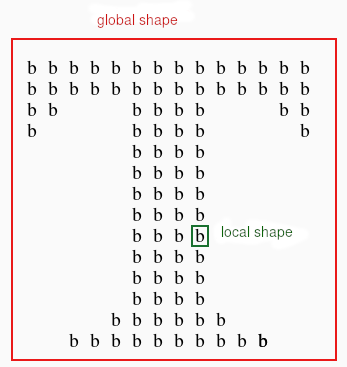
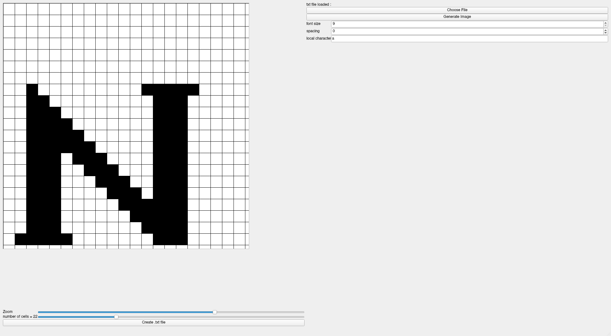
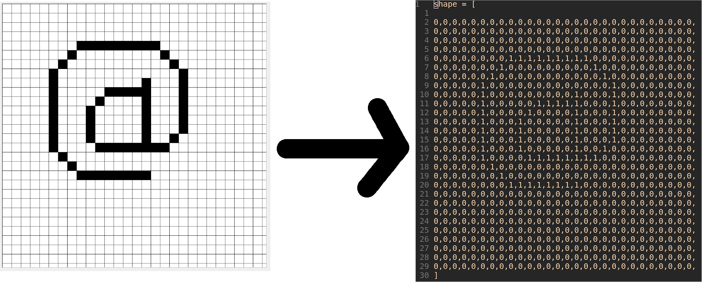
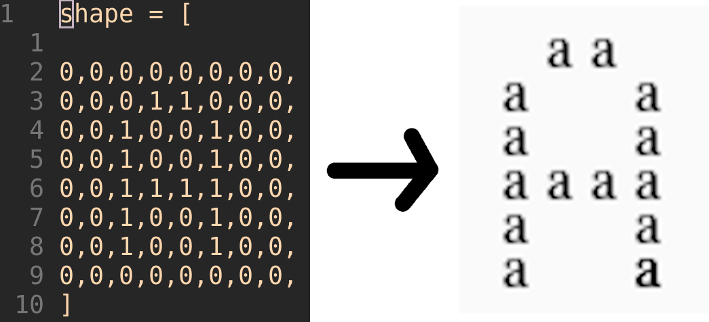

# Table of contents
1. Introduction
2. Problem
3. Chosen solution
4. Pseudo Code
5. Marketing aspect
6. To go futher
7. Conclusion

# Introduction
The mission was to build a generator of Navon shapes.  

{ width=50%}

# Problem
Making Navon figures is **tedious** and psychologist generally use *Excel* 

It usually takes **several minutes** to make one image. 

# Chosen Solution
Drawing application inspired by pixel art.
Made in C++ with the Qt5 Framework.

{ width=100%}

# Chosen Solution
## Canvas to bitmap 
{ width=100%}

# Pseudo code
## drawing and bitmap filling
	#event->x() return x coordinate of mouse click
	column = event->x()/cellSize
	row = event->y()/cellSize
	cellIndex = column + row * nbCells
	bitmap[cellIndex] = 1
	xpos = column*cellSize
	ypos = row*cellSize
	paintCell(xpos, ypos,cellSize, cellSize)

# Chosen Solution
## From bitmaps to image
{ width=100% }

# Pseudo code 
## image generation
	for int i=0; i<bitmap.size; i++:
		if i%sqrt(bitmap.size) == 0:
			<!-- line has ended, making newline-->
			positon.x = 0
			position.y = position.y+fontSize+spacing
		if bitmap[i] == 1:
			drawText(position, character)
		else
			position.x += fontsize+spacing

# Chosen Solution
## Pros
- Extremely **fast** and **easy** to use
- Customizable
- Linux, Windows, and MacOs support

## Cons
- Can only **approximate** curves by hand
- Quality of shapes depends on the **drawing** capabilities of the user

# Marketing Aspect
**Free** and **Open Source** software, with paid executable and support.
 
## Ways to get paid
- Donations
- Crowdfunding
- Charge for updates, added functionalities, etc...
- ~~Funding from a company~~ 

# To go futher
## Functionalities
- Ability to correct a text file from the application.
- Erase selected squares from the canvas.
- Improve user interface.
- add telemetry

## Android and IOS App
Qt apps are portable from one platform to another.

# Conclusion
Application works and is functionnal, but suffers from **Beta build quality**.

No other other generators exist to this day.

